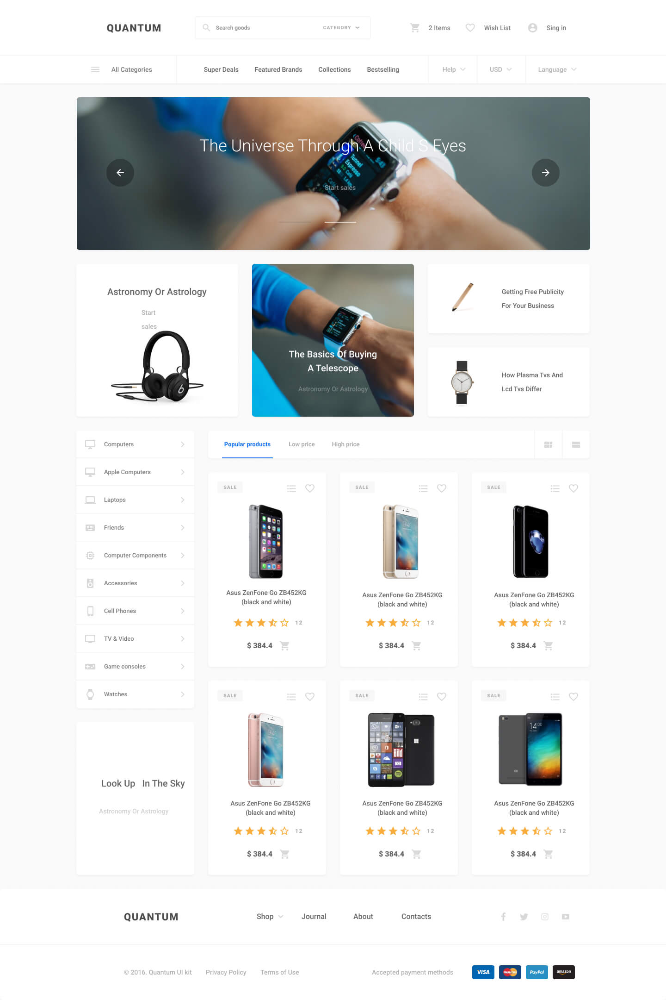

While having a license is important for specifying how others can use, modify, or distribute your project, it’s not strictly necessary if you’re not planning to share the project publicly or if you’re not concerned about legal implications.

Here’s the updated README without the license section:

```markdown
<h1 align="center">Ecommerce Project with Node.js - MVC</h1>

<p align="center">
  
  
  
</p>

> An E-commerce project built with Node.js using the MVC architecture. Designed and implemented by Mohammed Tousif.

<div align="center">
  
</div>

---

# :pushpin: Table of Contents

* [Technologies](#computer-technologies)
* [Features](#rocket-features)
* [How to Run](#construction_worker-how-to-run)
* [Issues](#bug-issues)
* [Contributing](#tada-contributing)

# :computer: Technologies
This project was created using the following technologies:
<ul>
  <li><a href="https://nodejs.org/en/">Node.js</a></li>
  <li><a href="https://expressjs.com/">Express</a></li>
  <li><a href="https://github.com/mysqljs/mysql">MySQL</a></li>
  <li><a href="https://www.npmjs.com/package/express-handlebars">Express Handlebars</a></li>
  <li><a href="https://eslint.org/">ESLint</a></li>
</ul>

# :rocket: Features

- List Products
- Filter products by Category
- Add products to Wishlist
- Add products to Cart

# :construction_worker: How to Run
## Install

```sh
npm install
```

## Usage

```sh
npm run start
```

## Dev Mode

```sh
npm run dev
```

Open [http://localhost:3000](http://localhost:3000) with your browser to see the result.

# :bug: Issues

If you encounter any issues or have suggestions for improvements, please feel free to open an issue on this repository. Contributions are welcome!

# :tada: Contributing

Thank you for your interest in contributing to this project. Please refer to the [CONTRIBUTING.md](./CONTRIBUTING.md) file for more details on how to contribute.
```

### Instructions to Update

1. **Edit the README**: Replace the content of your `README.md` file with the updated text above.
2. **Commit and Push Changes**:
   ```bash
   git add README.md
   git commit -m "Update README to remove license section"
   git push
   ```


